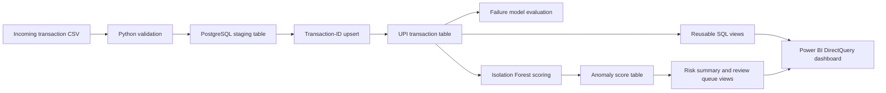
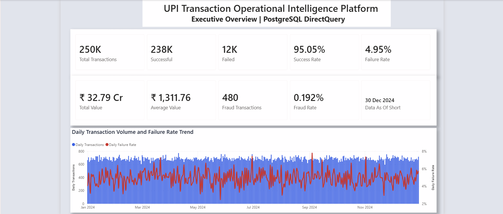
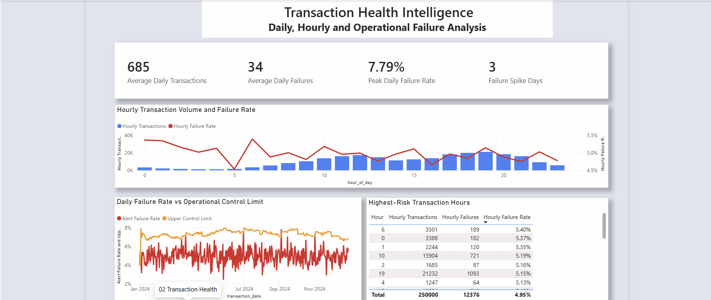
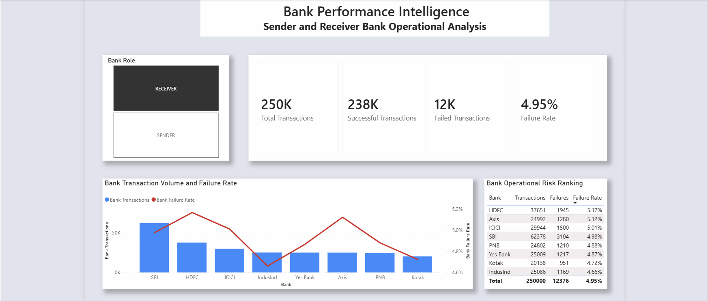
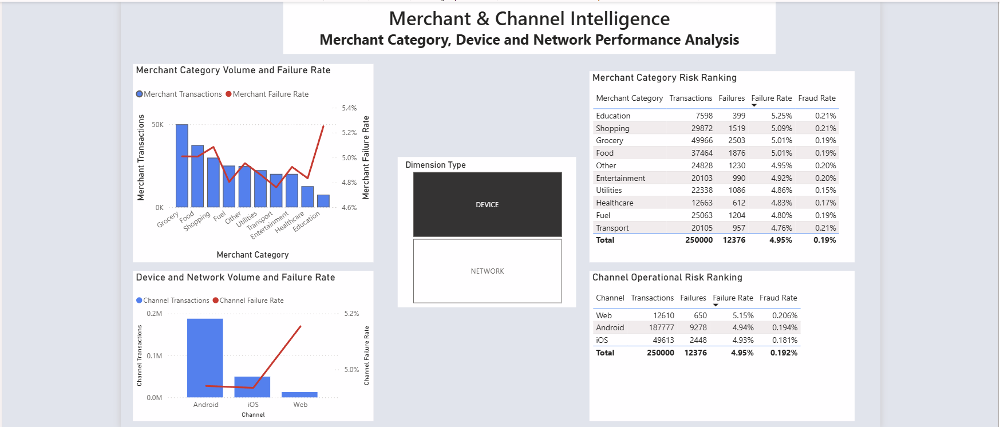
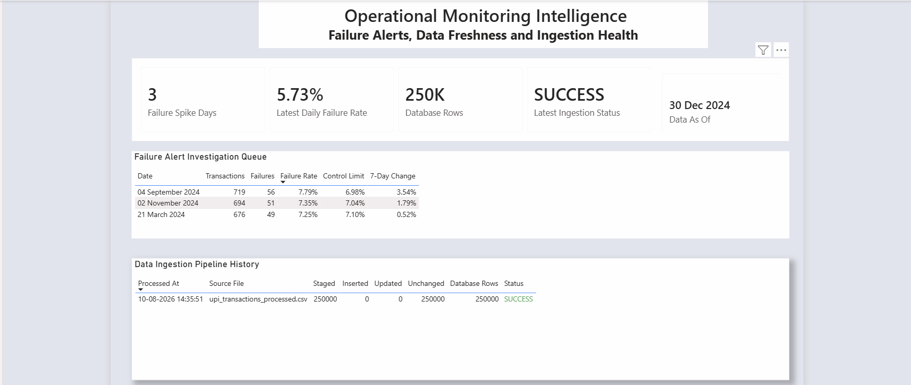

# UPI Transaction Operational Intelligence Platform

## Project Overview

A FinTech Operational Intelligence Platform that helps business and operations teams monitor transaction health, analyze failure trends, evaluate bank performance, and support operational decision-making using SQL, Power BI, and Machine Learning.

The platform analyzes transaction success and failure patterns, bank-wise performance, time-based trends, merchant categories, device usage, and network-related behaviour.

The main purpose of the project is not only to report transaction failures, but also to provide operational insights that can support faster and more informed decision-making.

---

## Business Problem

UPI platforms process a large number of transactions every day. When transaction failures increase, business and operations teams may not have enough visibility to identify the affected banks, time periods, transaction categories, or possible operational causes.

This project addresses that problem by creating an analytics and intelligence layer that helps stakeholders monitor transaction health and investigate unusual failure patterns.

## Project Objective

The objective of this project is to build a UPI operational intelligence solution that can:

- Monitor transaction success and failure rates
- Analyze bank-wise transaction performance
- Identify peak transaction and failure periods
- Compare merchant, device, and network behaviour
- Detect unusual transaction patterns
- Generate actionable insights for business and operations teams

## Dataset Summary

The project uses a synthetic UPI transaction dataset representing payment activity during 2024.

| Metric                      |                 Value |
| --------------------------- | --------------------: |
| Transactions                |               250,000 |
| Columns                     |                    17 |
| Data period                 | January–December 2024 |
| Successful transactions     |               237,624 |
| Failed transactions         |                12,376 |
| Success rate                |                95.05% |
| Failure rate                |                 4.95% |
| Total transaction value     |          ₹32.79 crore |
| Average transaction value   |             ₹1,311.76 |
| Fraud-labelled transactions |                   480 |
| Fraud rate                  |                0.192% |

The dataset is synthetic and contains no real customer or confidential banking information.

## Technology Stack

| Layer                 | Technologies                                     |
| --------------------- | ------------------------------------------------ |
| Business analysis     | BRD, requirements and KPI framework              |
| Data preparation      | Python, Pandas and NumPy                         |
| Statistical analysis  | SciPy                                            |
| Visualization         | Matplotlib                                       |
| Machine learning      | Scikit-learn and Isolation Forest                |
| Database              | PostgreSQL                                       |
| Database environment  | Docker and pgAdmin                               |
| Data pipeline         | Python, staging tables and Transaction-ID upsert |
| Business intelligence | Power BI and DAX                                 |
| Reporting connection  | PostgreSQL DirectQuery                           |
| Version control       | Git and GitHub                                   |

## Current Phase

- ✅ Phase 1 – Business Understanding
- ✅ Phase 2 – UPI Domain Research
- ✅ Phase 3 – Business Requirement Document
- ✅ Phase 4 – Data Collection
- ✅ Phase 5 – Data Quality & Cleaning
- ✅ Phase 6 – Exploratory Data Analysis
- ✅ Phase 7 – SQL Analytics
- ✅ Phase 8 – Power BI Dashboard
- ✅ Phase 9 – Machine Learning
- ✅ Phase 10 – Final Documentation and Portfolio Preparation

---

## How This Project Is Different

Many transaction analytics projects mainly focus on displaying transaction counts, success rates, and failure rates.

This project is positioned as an operational intelligence platform. It focuses on helping stakeholders understand:

- Which banks require investigation
- When transaction failures increase
- Which transaction segments are affected
- How transaction health changes over time
- What operational patterns should be prioritised

The project combines business understanding, Python-based analysis, SQL analytics, Power BI visualisation, and machine learning into one structured FinTech solution.

---

## Key Business Insights

- The platform processed **250,000 transactions** with an overall success rate of **95.05%**.
- P2P transactions represented **44.98%** of activity, followed by P2M transactions at **35.06%**.
- Grocery was the highest-volume merchant category with **49,966 transactions**.
- SBI handled approximately **25%** of both sender-bank and receiver-bank transaction volume.
- Android supported **75.11%** of transactions, while 4G supported **59.93%**.
- Transaction values were strongly right-skewed: the median was ₹629 compared with an average of ₹1,311.76.
- Platform-wide failure differences across the available dimensions were relatively small, indicating that persistent root causes were not strongly represented in the dataset.
- Statistical monitoring identified unusual daily failure spikes requiring operational investigation.
- Supervised models could not reliably predict failures using the available attributes, demonstrating the need for latency, response-code, retry and system-load features.
- Isolation Forest identified **2,500 High Anomaly transactions** for review, but anomaly status was correctly treated as behavioural unusualness rather than confirmed fraud.

## Dynamic Analytics Architecture

The platform is designed to accept additional transaction batches without rebuilding the analysis. New CSV records are validated, copied into a PostgreSQL staging table, and merged into the stable transaction table using `transaction_id` as the unique key.

```text
New transaction CSV
        -> Python ingestion command
        -> PostgreSQL staging table
        -> Transaction-ID upsert
        -> Stable production table
        -> Reusable SQL views
        -> Power BI refresh or DirectQuery
```

Existing Transaction IDs are updated only when their stored values change. New IDs are appended, unchanged IDs are skipped, and every ingestion run is recorded in an audit table.

See [`docs/09_Dynamic_Data_Pipeline.md`](docs/09_Dynamic_Data_Pipeline.md) for setup and operating instructions.

## Solution Architecture



Detailed component responsibilities and data flows are documented in [`diagrams/solution_architecture.md`](diagrams/solution_architecture.md).

## Project Structure

```text
dashboard/    -> Power BI report, connection guide, and screenshots
data/         -> Raw, processed, incoming, archived, and rejected data
docs/         -> Business, analytics, dashboard, and ML documentation
models/       -> Model metadata; large trained artifacts remain local
notebooks/    -> Data preparation, EDA, failure prediction, and anomaly detection
scripts/      -> Repeatable PostgreSQL ingestion and anomaly-score loading
sql/          -> Database schema, upsert logic, analytical queries, and views
README.md     -> Main recruiter-facing project overview
```

## Quick Start

### Prerequisites

Install the following applications:

- Python 3.11 or later
- Git
- Docker Desktop
- PostgreSQL client or pgAdmin 4
- Power BI Desktop

### 1. Clone the repository

```powershell
git clone https://github.com/KaviyaVelmurugan/upi-transaction-intelligence-platform.git
cd upi-transaction-intelligence-platform
```

### 2. Create a Python environment

```powershell
python -m venv .venv
.venv\Scripts\Activate.ps1
pip install -r requirements.txt
```

### 3. Start PostgreSQL with Docker

For the first setup:

```powershell
docker run --name upi-postgres `
  -e POSTGRES_DB=upi_transaction_intelligence `
  -e POSTGRES_USER=upi_admin `
  -e POSTGRES_PASSWORD=change_me `
  -p 5433:5432 `
  -d postgres:17
```

For later sessions, start the existing container:

```powershell
docker start upi-postgres
```

Use a secure local password instead of `change_me`. Never commit the real password to GitHub.

### 4. Create the database layer

Connect pgAdmin to:

```text
Host: 127.0.0.1
Port: 5433
Database: upi_transaction_intelligence
User: upi_admin
```

Run these files in order:

1. `sql/schema.sql`
2. `sql/ingestion.sql`
3. `sql/views.sql`

### 5. Load the transaction dataset

```powershell
python scripts/ingest_transactions.py --file data/processed/upi_transactions_processed.csv
```

If the database password is not stored in an environment variable, the script requests it securely in the terminal.

The ingestion process:

- Validates the incoming schema
- Rejects duplicate Transaction IDs within the batch
- Loads data into a staging table
- Inserts new records
- Updates changed records
- Skips unchanged records
- Records the ingestion result in an audit table

### 6. Run the analytical notebooks

Open and run the notebooks in this order:

1. `notebooks/01_data_quality_and_cleaning.ipynb`
2. `notebooks/02_eda.ipynb`
3. `notebooks/03_failure_prediction.ipynb`
4. `notebooks/04_anomaly_detection.ipynb`

The anomaly notebook generates local scoring outputs and the trained Isolation Forest pipeline.

### 7. Load anomaly scores into PostgreSQL

Run `sql/anomaly_detection.sql` in pgAdmin, then execute:

```powershell
python scripts/load_anomaly_scores.py --file data/processed/anomaly_scores.csv
```

This creates or updates the anomaly-scoring layer using Transaction ID as the unique key.

### 8. Open the Power BI dashboard

Open:

```text
dashboard/UPI_Operational_Intelligence_Dashboard.pbix
```

Keep the PostgreSQL Docker container running and refresh the Power BI report. The dashboard uses PostgreSQL DirectQuery and reusable SQL views.

For detailed operating instructions, see:

- [`sql/README.md`](sql/README.md)
- [`dashboard/README.md`](dashboard/README.md)
- [`docs/09_Dynamic_Data_Pipeline.md`](docs/09_Dynamic_Data_Pipeline.md)

## Power BI Operational Dashboard

The five-page Power BI dashboard connects to PostgreSQL using DirectQuery, allowing the report to retrieve current analytical results from reusable SQL views.

### 1. Executive Overview



### 2. Transaction Health Intelligence



### 3. Bank Performance Intelligence



### 4. Merchant and Channel Intelligence



### 5. Operational Monitoring Intelligence



## Machine Learning and Anomaly Detection

Phase 9 evaluated two AI capabilities: transaction-failure prediction and behavioural anomaly detection.

### Transaction Failure Prediction

Three classification approaches were evaluated using a chronological train–test split:

| Model               | Failure Precision | Failure Recall | Failure F1 | PR-AUC | ROC-AUC |
| ------------------- | ----------------: | -------------: | ---------: | -----: | ------: |
| Dummy Baseline      |             0.00% |          0.00% |      0.00% |  4.85% |  50.00% |
| Logistic Regression |             4.83% |         47.32% |      8.76% |  4.78% |  49.50% |
| Random Forest       |             4.44% |          3.83% |      4.11% |  4.83% |  50.05% |

The available transaction attributes did not provide sufficient predictive signal for reliable failure prediction. Therefore, no failure classifier was presented as production-ready.

This decision prevents misleading conclusions based only on accuracy and demonstrates responsible model evaluation for imbalanced financial data.

### Behavioural Anomaly Detection

An Isolation Forest pipeline was developed using 13 behavioural features, including transaction context, log-transformed amount and cyclical hour features.

| Risk Band    | Transactions |  Share | Failure Rate | Average Amount |
| ------------ | -----------: | -----: | -----------: | -------------: |
| Normal       |      237,500 | 95.00% |       4.947% |      ₹1,291.59 |
| Monitor      |       10,000 |  4.00% |       4.980% |      ₹1,668.66 |
| High Anomaly |        2,500 |  1.00% |       5.120% |      ₹1,799.56 |

The model identifies behavioural unusualness rather than confirmed fraud. High-anomaly transactions are placed in an investigation queue for operational review.

### Database Integration

Anomaly scores were loaded into PostgreSQL using an idempotent upsert workflow based on Transaction ID.

The following reusable views support reporting and investigation:

- `vw_anomaly_risk_summary`
- `vw_high_anomaly_review_queue`

Supporting files:

- [`notebooks/03_failure_prediction.ipynb`](notebooks/03_failure_prediction.ipynb)
- [`notebooks/04_anomaly_detection.ipynb`](notebooks/04_anomaly_detection.ipynb)
- [`scripts/load_anomaly_scores.py`](scripts/load_anomaly_scores.py)
- [`sql/anomaly_detection.sql`](sql/anomaly_detection.sql)
- [`docs/11_Machine_Learning_and_Anomaly_Detection.md`](docs/11_Machine_Learning_and_Anomaly_Detection.md)

```

```

## Documentation

| Document                                                                                            | Purpose                                                            |
| --------------------------------------------------------------------------------------------------- | ------------------------------------------------------------------ |
| [`01_BRD.md`](docs/01_BRD.md)                                                                       | Business problem, objectives, scope, stakeholders and requirements |
| [`02_Dataset_Selection_Criteria.md`](docs/02_Dataset_Selection_Criteria.md)                         | Criteria used to assess candidate datasets                         |
| [`03_Dataset_Evaluation.md`](docs/03_Dataset_Evaluation.md)                                         | Comparison of available datasets                                   |
| [`04_Final_Dataset_Selection.md`](docs/04_Final_Dataset_Selection.md)                               | Final dataset decision and justification                           |
| [`05_Data_Understanding.md`](docs/05_Data_Understanding.md)                                         | Dataset structure, fields and initial assessment                   |
| [`06_Data_Quality_Assessment.md`](docs/06_Data_Quality_Assessment.md)                               | Missing values, duplicates, types and validation                   |
| [`07_Exploratory_Data_Analysis.md`](docs/07_Exploratory_Data_Analysis.md)                           | Univariate, bivariate, time, failure and statistical analysis      |
| [`08_SQL_Analytics.md`](docs/08_SQL_Analytics.md)                                                   | PostgreSQL validation, KPIs and dimensional analytics              |
| [`09_Dynamic_Data_Pipeline.md`](docs/09_Dynamic_Data_Pipeline.md)                                   | Repeatable ingestion and refreshable architecture                  |
| [`10_PowerBI_Dashboard_Requirements.md`](docs/10_PowerBI_Dashboard_Requirements.md)                 | Dashboard pages, stakeholders, KPIs and reporting requirements     |
| [`11_Machine_Learning_and_Anomaly_Detection.md`](docs/11_Machine_Learning_and_Anomaly_Detection.md) | Failure-model evaluation and Isolation Forest implementation       |
| [`12_Final_Project_Report.md`](docs/12_Final_Project_Report.md)                                     | Final executive summary, verified outcomes and project sign-off    |
| [`13_Portfolio_and_Interview_Guide.md`](docs/13_Portfolio_and_Interview_Guide.md)                   | Resume bullets and interview-ready project explanations            |

## Business Recommendations

1. Monitor success and failure rates using statistical control limits rather than relying only on fixed thresholds.
2. Prioritize high-volume banks when investigating failures because small rate changes can affect many transactions.
3. Maintain daily and hourly operational views to detect sudden performance deterioration.
4. Use the High Anomaly queue for investigation and not as an automatic fraud-blocking mechanism.
5. Collect API response time, bank latency, retry count, error code and server-load data before rebuilding the failure-prediction model.
6. Review anomaly patterns across device, network, transaction type and merchant category combinations.
7. Record investigation outcomes so future supervised models can learn from reliable operational labels.
8. Refresh Power BI after each ingestion or use DirectQuery to retrieve current PostgreSQL results.

## Limitations

- The dataset is synthetic and does not contain real customer or banking records.
- The project demonstrates portfolio-scale operational analytics rather than production UPI processing.
- Available features do not include API latency, response codes, server load, retry attempts or bank-availability signals.
- Failure-prediction models did not achieve sufficient discriminatory performance for deployment.
- Isolation Forest identifies unusual behaviour, not confirmed fraud.
- The 1% High Anomaly volume is influenced by the configured contamination assumption.
- PostgreSQL runs locally through Docker; a production deployment would require managed infrastructure, security controls and monitoring.
- Power BI Service deployment and gateway configuration are outside the current local-project scope.

## Conclusion

The UPI Transaction Operational Intelligence Platform demonstrates the complete lifecycle of an analytics product: business understanding, data validation, exploratory analysis, statistical testing, PostgreSQL analytics, repeatable ingestion, Power BI reporting and responsible machine-learning evaluation.

The project converts a static transaction dataset into a refreshable operational architecture. New transaction batches can be validated and merged into PostgreSQL, reusable SQL views update the analytical layer, and Power BI retrieves current results using DirectQuery.

The machine-learning phase also demonstrates an important professional decision: models that do not provide reliable predictive value are not presented as deployable solutions. Instead, the project uses Isolation Forest to create a transparent behavioural investigation queue while clearly separating anomaly detection from fraud classification.

## License

This project is available under the [MIT License](LICENSE).
