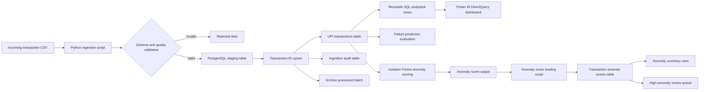

# UPI Transaction Operational Intelligence Platform — Solution Architecture

## 1. Architecture Objective

The architecture converts UPI transaction files into a validated, refreshable operational-intelligence system.

It supports:

- Repeatable transaction ingestion
- Duplicate-safe inserts and updates
- PostgreSQL business analytics
- Power BI DirectQuery reporting
- Failure-model evaluation
- Behavioural anomaly scoring
- Operational investigation queues

## 2. End-to-End Architecture

## 3. Architecture Layers

| Layer              | Components                       | Responsibility                                          |
| ------------------ | -------------------------------- | ------------------------------------------------------- |
| Data source        | Raw and incoming CSV files       | Supplies historical and additional transaction batches  |
| Ingestion          | `scripts/ingest_transactions.py` | Validates and submits transaction batches to PostgreSQL |
| Staging            | PostgreSQL staging table         | Temporarily holds validated records before merging      |
| Storage            | `public.upi_transactions`        | Maintains the stable transaction dataset                |
| Audit              | Ingestion-history table          | Records the outcome of every ingestion batch            |
| Analytics          | Reusable PostgreSQL views        | Calculates KPIs, trends and operational indicators      |
| Reporting          | Power BI DirectQuery dashboard   | Presents current database results to stakeholders       |
| Failure modelling  | Failure-prediction notebook      | Evaluates whether available attributes predict failures |
| Anomaly modelling  | Isolation Forest pipeline        | Scores behavioural unusualness                          |
| Anomaly operations | Score table and review views     | Supports anomaly monitoring and investigation           |

## 4. Transaction Ingestion Flow

1. A new CSV file is placed in `data/incoming`.
2. The Python ingestion script validates its schema.
3. Invalid batches are rejected before reaching the production table.
4. Valid records are loaded into a PostgreSQL staging table.
5. Transaction ID determines whether each record is inserted, updated or left unchanged.
6. The ingestion outcome is recorded in the audit table.
7. Reusable SQL views automatically reflect the current transaction table.
8. Power BI retrieves the updated analytical results through DirectQuery.

## 5. Anomaly-Scoring Flow

1. The anomaly notebook creates behavioural features.
2. Isolation Forest assigns an anomaly score to each transaction.
3. Scores are classified into Normal, Monitor and High Anomaly bands.
4. The scoring output is saved locally.
5. `scripts/load_anomaly_scores.py` loads or updates scores in PostgreSQL.
6. `vw_anomaly_risk_summary` summarizes the three risk bands.
7. `vw_high_anomaly_review_queue` provides detailed transactions for investigation.

Anomaly classification indicates behavioural unusualness. It does not confirm fraud.

## 6. Key Design Decisions

### Transaction-ID upsert

Transaction ID is used as the stable unique key. This prevents duplicate ingestion while allowing changed records to be updated.

### Staging before production

Incoming records are first copied into a staging table. This separates validation and loading from the stable production dataset.

### Reusable SQL views

Business calculations are stored in database views rather than embedded independently in every Power BI visual. This improves consistency and maintainability.

### DirectQuery reporting

Power BI uses DirectQuery so visuals retrieve current PostgreSQL results while the local database is running.

### Responsible machine learning

Failure classifiers were evaluated using metrics appropriate for class imbalance. Because they did not provide sufficient predictive value, they were not presented as deployable models.

### Investigation-based anomaly detection

High-anomaly transactions are routed to a review queue rather than automatically blocked or labelled as fraud.

## 7. Security and Production Considerations

The portfolio implementation uses synthetic data and a local Docker-based PostgreSQL instance.

A production implementation would additionally require:

- Secret management
- Encrypted database connections
- Role-based access control
- Personally identifiable information protection
- Database backup and recovery
- Data-retention policies
- Pipeline monitoring and alerting
- Model monitoring and drift detection
- Power BI gateway configuration
- Managed cloud infrastructure

## 8. Architecture Outcome

The final architecture upgrades the project from a static notebook analysis into a reproducible operational-intelligence platform. Transaction batches can be loaded repeatedly, analytical views remain consistent, Power BI can retrieve current results, and anomaly scores can be integrated into operational review workflows.
